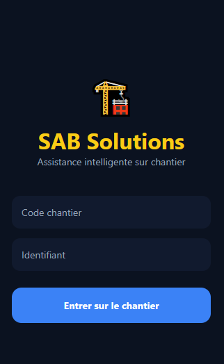
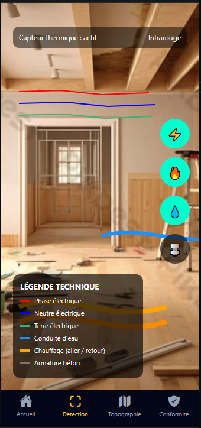
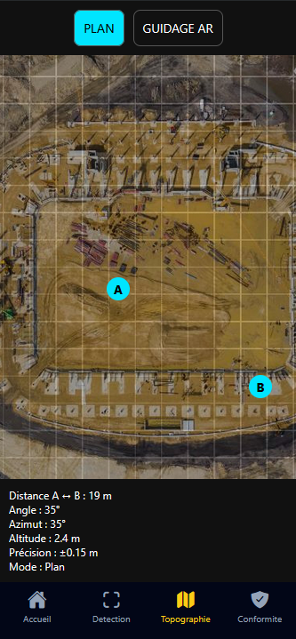
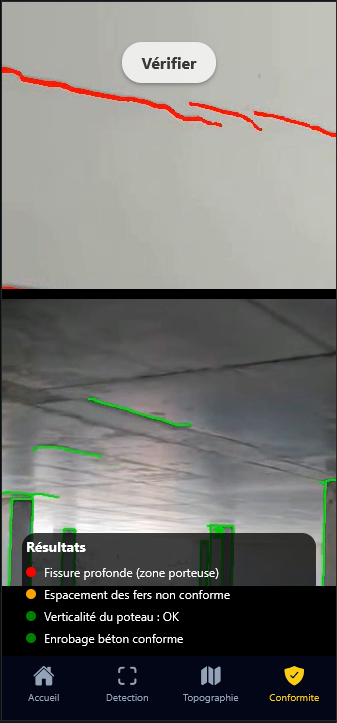

# Prototype d’App d’Assistance sur Chantier avec AR & IA

## 📱 Description

Ce projet est un prototype d'application mobile visant à assister les professionnels du bâtiment et du génie civil sur les chantiers grace à l'Intelligence Artificielle et la Réalitée Augmentée.

L’application combine :
Visualisation AR des plans et modèles 3D :
Superposition des plans numériques sur le chantier réel via la caméra du mobile/tablette.

Reconnaissance intelligente :
Détection des éléments critiques (structures, câblages, équipements) et identification des problèmes potentiels grâce à l’IA.

L’objectif est de réduire les erreurs, améliorer la sécurité et optimiser le flux de travail sur le chantier.

## Fonctionnalités Principales
### Fonctionnalité Scan – Détection sur chantier 🔍

L’application inclut un mode Scan intelligent qui permet de détecter en temps réel différents éléments critiques sur le chantier :

Fils électriques : repère la présence de câbles pour éviter tout risque d’électrocution ou de coupure.

Conduites d’eau : localise tuyaux et canalisations pour prévenir les fuites lors du perçage ou de travaux.

Système de chauffage : détecte les radiateurs, circuits de chauffage ou plancher chauffant.

Armature en béton : identifie les barres d’armature pour éviter d’endommager la structure.

### Fonctionnalité Topographie & Calibration 📐

L’application intègre un module de calibration de la caméra et de repérage topographique basé sur les maps.
Il permet d’aligner précisément les données AR avec l’environnement réel (dimensions, distances, orientation) pour garantir des mesures fiables et un positionnement exact sur le chantier.

### Fonctionnalité Détection d’Anomalies ⚠️

L’application analyse les surfaces et structures pour détecter automatiquement les anomalies telles que fissures, défauts structurels ou non-alignements.
Grâce à l’IA, ces zones à risque sont mises en évidence en temps réel afin de faciliter l’inspection et la maintenance préventive.

### Backend IA (Futur – Temps Réel) 

Le backend IA est développé en Python sur Google Colab pour l’entraînement et les tests des modèles d’intelligence artificielle.
À terme, il sera connecté à l’application mobile via une API, afin de permettre l’analyse des données et la détection en temps réel directement depuis le chantier.

## Liens vers le projet
### Application Mobile
- [Lancer le projet sur Snack Expo Dev](https://snack.expo.dev/@randomuzer7/btp_app2)
- Vous pouvez aussi télécharger l'appcation Expo Go, en suite scanner le QR code en cliquant sur "My device", pour visualiser l'application sur votre téléphone.

### Back end Google Colab
- Importez le Notebook Ipython (fichier .ipynb) dans votre google colab.
- Testez les cellules en téléchargant des photos et vidéo, et visualisez  les résultats !
- permet la détéction de fissures dans les murs, l'alignement des poteaux, la détéction de contours...etc
- API (cellule 1) pour une future détéction en temps réel.

##  Technologies utilisées

- Application CrossPlatform avec React Native / Expo
- Réalité Augmentée et Superposition de modèles 3D
- Backend / IA et simulation API avec Google Colab (Python)